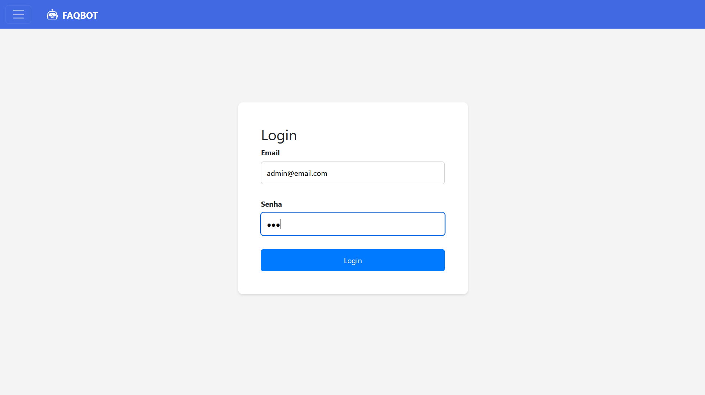
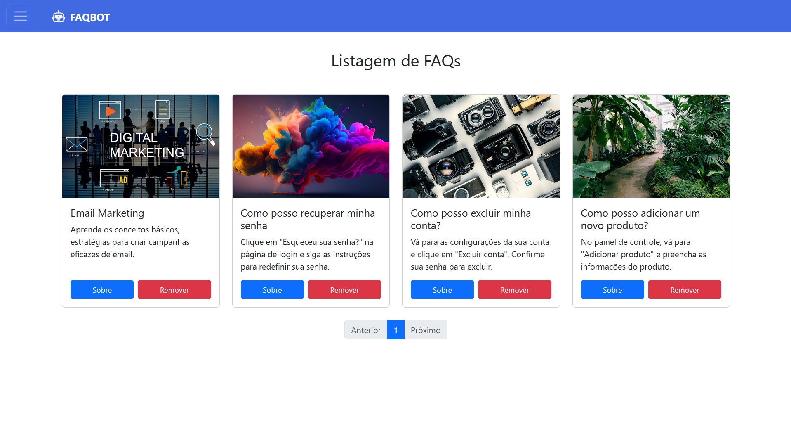
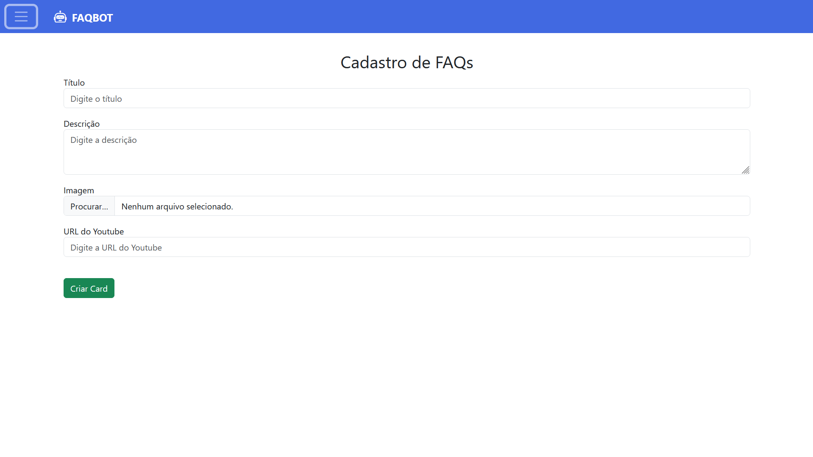
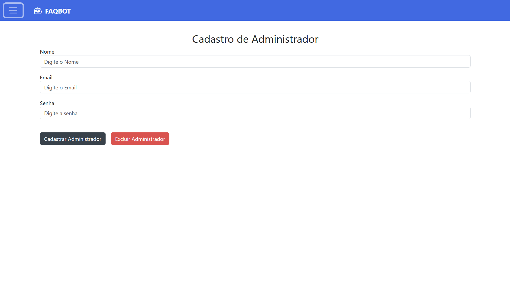
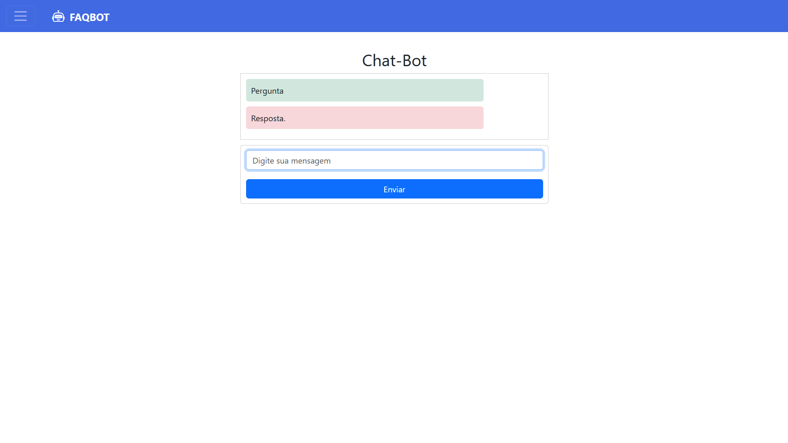

# FAQBOT

FaqBot - Um projeto desenvolvido para gerenciar FAQs e Chat-Bot para uma loja de e-commerce. Ele inclui funcionalidades como cadastro de FAQs, cadastro de administradores, chatbot e um tour interativo para novos usuários. Este projeto foi criado utilizando Vue.js com um design responsivo e moderno.

## Requisitos

- [Node.js](https://nodejs.org/) (versão 14 ou superior)
- [npm](https://www.npmjs.com/) (geralmente incluído com o Node.js) ou [Yarn](https://yarnpkg.com/)

## Tela de Login com autenticação JWT



## Tela de Listagem de FAQs



## Tela de Cadastro de FAQs



## Tela de Cadastro de Administradores



## Tela de ChatBot



## Instalação

### Passo 1: Clone o repositório

```bash
git clone https://github.com/SEU_USUARIO/NOME_DO_REPOSITORIO.git
cd NOME_DO_REPOSITORIO
```

## Instalação

### Passo 1: Clone o repositório
```base
git clone https://github.com/Piveto/finalsprint-tray.git
```

### Passo 2: Instale as dependências
```base
npm install
```

### Passo 3: Iniciar o servidor
```base
npm run dev
```